# Purpose:
- The primary purpose of a to-do list application is to help users organize and manage their tasks effectively. It serves as a memory aid, allowing users to keep track of what they need to accomplish, prioritize their tasks, and enhance their productivity. 

# Target Audience:
- The target audience for a to-do list application is for anyone who wants to enhance their organisational skills and reduce the mental load associated with managing multiple tasks in daily life.

# User Stories

## User Registration and Authentication:
- As a user, I want to sign up with my email and password so that I can create an account to manage my to-do lists.
- As a user, I want to log in securely using my credentials so that I can access my to-do list.
- As a user, I want to be able to reset my password in case I forget it so that I can regain access to my account.

## Creating To-Do Items:
- As a user, I want to add new tasks to my to-do list with a title and description so that I can track what needs to be done.
- As a user, I want to set deadlines for tasks (due dates) so that I can prioritize and complete them on time.
- As a user, I want to assign tasks to specific categories (e.g., work, personal, errands) so that I can organize my tasks more effectively.

## Viewing and Managing To-Do Items
- As a user, I want to see a list of all my to-do tasks in order of creation or due date so that I can have an overview of all my tasks.
- As a user, I want to edit or update tasks (e.g., change the title, description, or due date) in case something changes.
- As a user, I want to delete tasks when they are no longer needed so that I can keep my list tidy.

## Marking Tasks as Complete:
- As a user, I want to mark tasks as "complete" so that I can keep track of what I have accomplished.
- As a user, I want to see my completed tasks in a separate section so that I can review what I’ve done without cluttering my active task list.
- As a user, I want to unmark a task as complete if I accidentally mark it done.

## Updating Tasks:
- As a user, I want to update the details of an existing task (e.g., change the title, description, or due date) so that I can modify tasks when things change.
- As a user, I want to edit a task's status to mark it as completed or pending so that I can track its progress accurately.
- As a user, I want to receive confirmation that my task has been successfully updated so that I know the changes were saved.

## Deleting Tasks:
- As a user, I want to delete a task from my to-do list so that I can remove tasks that are no longer relevant or needed.
- As a user, I want to receive a confirmation prompt before a task is permanently deleted so that I don’t accidentally delete tasks.
- As a user, I want to see a success message once a task has been deleted so that I am assured the task is removed.

# Features

## Home Page
The homepage of the to-do list application is designed to be user-friendly and efficient, allowing users to quickly add, view, and manage their tasks. The layout should be intuitive, enabling users to focus on their productivity without unnecessary distractions.
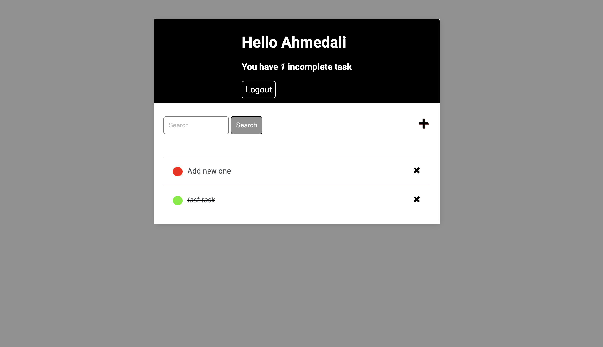

# Security
In order to use the website, the users needs to have an account and login. This ensures security of their tasks and gives them rights to create, modify and delete them.

## Login Page
The login page is accessible through the same page where the registration page is. This will lead them to the sign in page. This design also helps the users that registered to login from one simple page. The backend service will identify what the email is under and display the correct tabs and features they need.
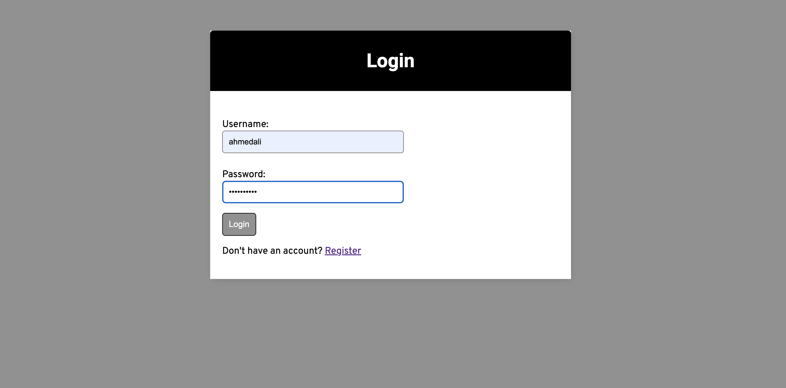
## Signup Page
The registration page is accessible through the login page of the site this will guide them to register and inform them in which area they should register. This simple design makes it easy to figure out and reduces the need of extra pages.
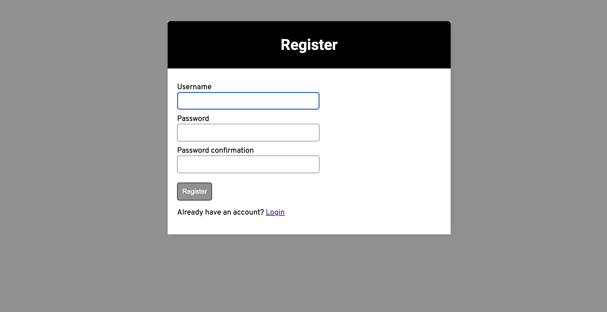

## Confirm delete
The purpose of a "Confirm Delete" feature in an the application is to ask users for confirmation before performing a delete action. Deleting an item is often irreversible, so it's important to ensure that the user really wants to delete the item. This confirmation step helps to prevent accidental deletions.
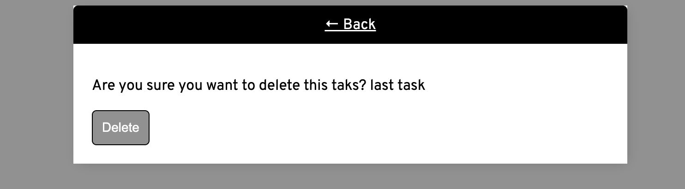

## Update todo
The update feature in the application serves the purpose of allowing users to modify or edit existing tasks. This feature is essential for maintaining the accuracy of task details and allows users to make changes as their priorities, deadlines, or task descriptions evolve.
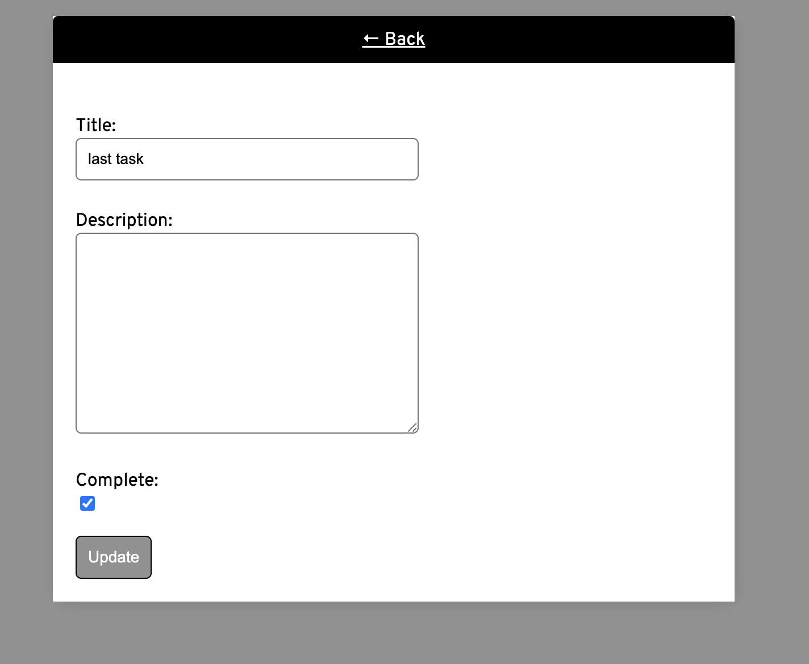
## Logout
The logout button is accessible through the home page of the site this will guide them to logout. 

# Wireframes

Wireframes were created in Balsamiq. They were used for initial planning of template layouts.

Home page wireframe
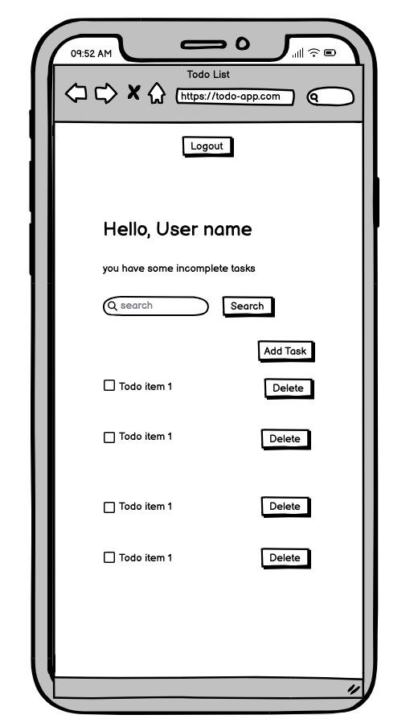 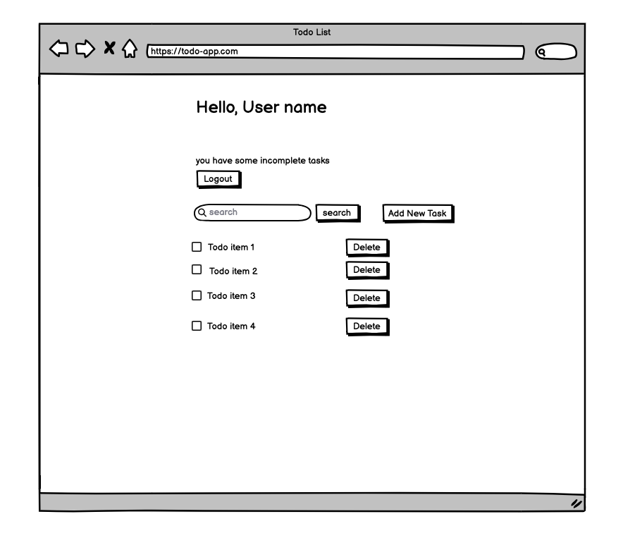 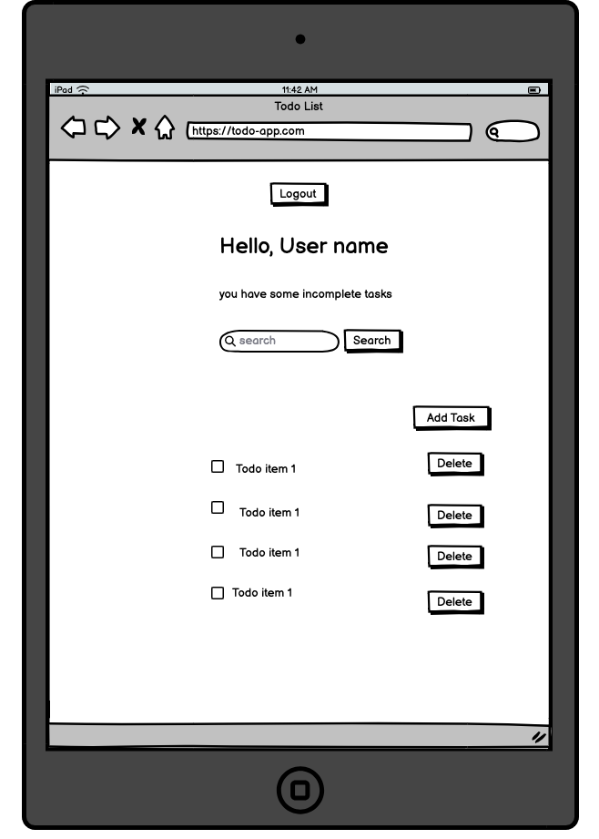

Signup page
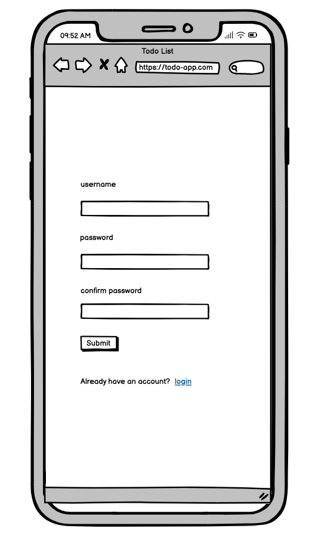 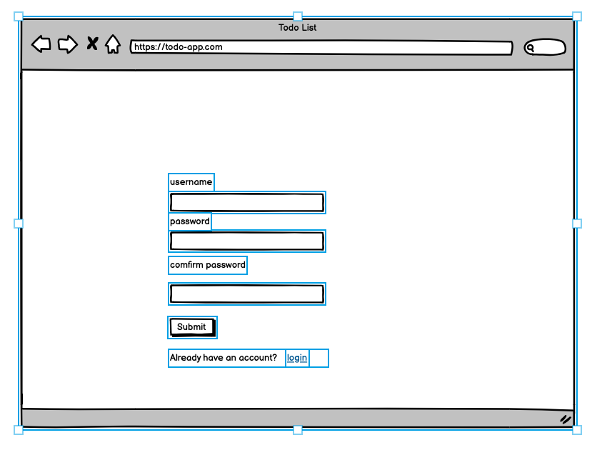 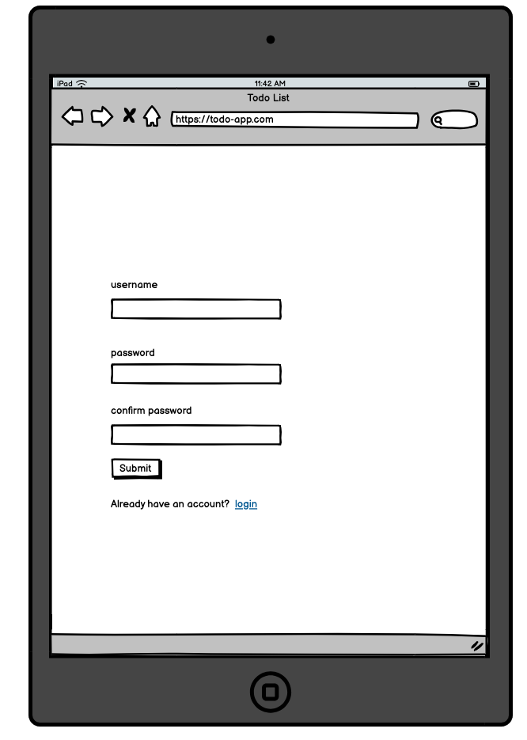

Login page
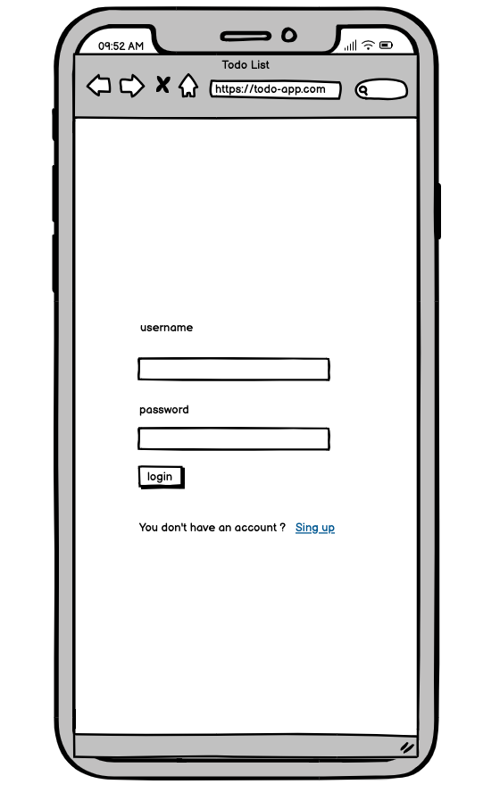
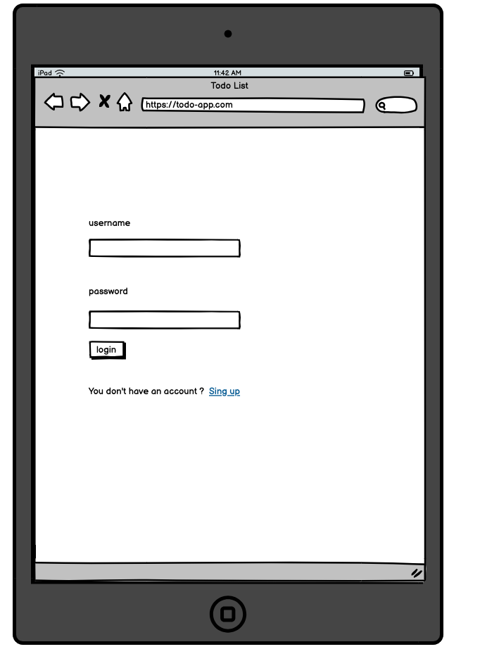
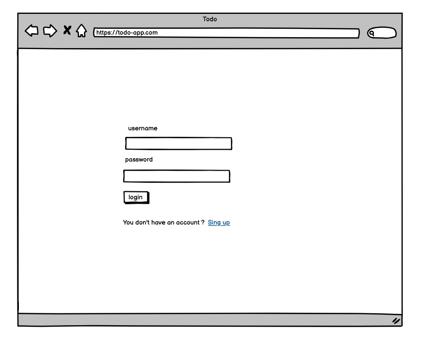

# Technologies Used

- [HTML5](https://www.w3schools.com/html/): mark-up language.
- [CSS3](https://www.w3schools.com/css/): styling.
- [Python3](https://www.python.org/): programming language.
- [Django](https://www.djangoproject.com/) 
- [GIT](https://git-scm.com/): for version control.
- [GitHub](https://github.com/users/Ahmed109-eng/projects/2/views/1): for host repository.
- [Gitpod](https://www.gitpod.io/): online IDE.
- [Heroku](https://verify.salesforce.com/v1/verify/): For deployment
- [Google Fonts](): to import fonts.
- [Balsamiq](): to create wireframes.

# Testing 
The app Testing was performed manually for logins, and displaying the correct information. adding new tasks, updating tasks and deleting tasking.

# Validation of HTML, CSS, JS, and Python Code
I used the following validation tools to validate HTML, CSS, PYTHON codes.
- HTML using (https://validator.w3.org/)
- CSS using (https://jigsaw.w3.org/css-validator/)
- Python (https://pep8ci.herokuapp.com/)
# Deployment
here is the deployed link https://todo---app-b5fa8ab4b245.herokuapp.com/
# Credits

- https://www.youtube.com/watch?v=FxoxQtPrKGc

- https://learn.codeinstitute.net/courses/course-v1:CodeInstitute+FSD101_WTS+4/courseware/713441aba05441dfb3a7cf04f3268b3f/6b4a4f493cbd46ecb6f6a841c98f0c82/?child=first

- https://betterstack.com/community/guides/scaling-python/django-postgresql/#step-6-adding-recipes
